# 🚀 LAMP Stack WordPress Deployment on AWS

<div align="center">


[](LICENSE)
[](https://aws.amazon.com/)
[](https://wordpress.org/)
[](https://en.wikipedia.org/wiki/LAMP_(software_bundle))

### 📊 Scalable WordPress Deployment with High Availability & Global CDN

**Production-ready WordPress infrastructure using LAMP Stack, EC2, RDS, ALB, Auto Scaling & CloudFront**

[Architecture](#-architecture) • [Quick Start](#-quick-start) • [Features](#-features) • [Documentation](#-documentation)

</div>

---

## 🎯 Project Overview

A **production-grade WordPress hosting solution** on AWS that combines the proven **LAMP stack** (Linux, Apache, MySQL, PHP) with modern cloud services for **scalability**, **high availability**, and **global performance**.

### Why This Architecture?

```bash
graph LR
    A[Traditional Hosting<br/>Single Server] -->|Transform to| 
    B[AWS Cloud<br/>Multi-Service]
    B --> C[🌍 Global Scale]

```

**Benefits:**
- ⚡ **99.99% Uptime** with multi-AZ deployment
- 🌍 **Global Performance** via CloudFront CDN
- 📈 **Auto-scaling** based on traffic
- 🔒 **Enterprise Security** with VPC & encryption
- 💰 **Cost-optimized** pay-as-you-grow model

---

## ✨ Features

<table>
<tr>
<td width="50%">

### 🏗️ **Scalable Infrastructure**
- ✅ Auto Scaling Groups (ASG)
- ✅ Multi-AZ deployment
- ✅ Load balancing (ALB)
- ✅ CloudFront CDN caching

</td>
<td width="50%">

### 🔒 **Enterprise Security**
- ✅ VPC isolation
- ✅ SSL/TLS encryption
- ✅ Security Groups
- ✅ Private subnets

</td>
</tr>
<tr>
<td width="50%">

### 📊 **High Performance**
- ✅ LAMP stack optimized
- ✅ Managed RDS MySQL
- ✅ Edge caching (CloudFront)
- ✅ EBS optimization

</td>
<td width="50%">

### 🛠️ **Easy Management**
- ✅ Automated backups
- ✅ CloudWatch monitoring
- ✅ One-click deployment
- ✅ Database snapshots

</td>
</tr>
</table>

---

## 🏗️ Architecture

### 🎨 High-Level Architecture Diagram

```mermaid
graph TB
    subgraph Internet
        Users[👥 Global Users]
        DNS[🌐 Route 53 DNS]
    end
    
    subgraph CloudFront_CDN[CloudFront CDN Layer]
        CF[☁️ CloudFront Distribution<br/>Edge Locations Worldwide]
    end
    
    subgraph AWS_Region[AWS Region - Multi-AZ]
        subgraph Public_Subnet[Public Subnet - DMZ]
            ALB[⚖️ Application Load Balancer<br/>Health Checks & SSL]
        end
        
        subgraph Private_Subnet_Web[Private Subnet - Web Tier]
            ASG[🔄 Auto Scaling Group]
            EC2_1[🖥️ EC2 Instance 1<br/>LAMP Stack]
            EC2_2[🖥️ EC2 Instance 2<br/>LAMP Stack]
            EC2_3[🖥️ EC2 Instance N<br/>LAMP Stack]
        end
        
        subgraph Private_Subnet_DB[Private Subnet - Database Tier]
            RDS[🗄️ Amazon RDS MySQL<br/>Multi-AZ Deployment]
        end
    end
    
    Users -->|HTTPS Request| DNS
    DNS -->|Route to| CF
    CF -->|Cache Miss| ALB
    CF -->|Cache Hit - Static Assets| Users
    ALB -->|Distribute Traffic| ASG
    ASG --> EC2_1
    ASG --> EC2_2
    ASG --> EC2_3
    EC2_1 & EC2_2 & EC2_3 -->|Database Queries| RDS
    
```



---

### 🔄 Request Flow


---

### 📦 Component Details

| Component | Technology | Purpose | Configuration |
|-----------|-----------|---------|---------------|
| **🐧 OS** | Amazon Linux 2 | Base operating system | Optimized for AWS |
| **🌐 Web Server** | Apache 2.4 | HTTP server | Virtual hosts, mod_rewrite |
| **🐘 Database** | RDS MySQL 8.0 | Data persistence | Multi-AZ, automated backups |
| **⚡ Scripting** | PHP 8.1 | Server-side processing | OpCache enabled |
| **📝 CMS** | WordPress 6.x | Content management | Latest stable version |
| **⚖️ Load Balancer** | ALB | Traffic distribution | Health checks, SSL termination |
| **🔄 Auto Scaling** | ASG | Dynamic capacity | CPU/Network based triggers |
| **☁️ CDN** | CloudFront | Global caching | 200+ edge locations |

---

## 🚀 Quick Start

### Prerequisites

```bash
✅ AWS Account with appropriate IAM permissions
✅ AWS CLI installed and configured
✅ SSH key pair for EC2 access
✅ Domain name (optional, for Route 53)
✅ Basic knowledge of AWS services
```

### 📋 Step-by-Step Deployment

<details open>
<summary><b>1️⃣ VPC & Network Setup</b></summary>

**Create VPC:**
```bash
# Create VPC
aws ec2 create-vpc --cidr-block 10.0.0.0/16 --tag-specifications 'ResourceType=vpc,Tags=[{Key=Name,Value=WordPress-VPC}]'

# Create Internet Gateway
aws ec2 create-internet-gateway --tag-specifications 'ResourceType=internet-gateway,Tags=[{Key=Name,Value=WordPress-IGW}]'

# Attach IGW to VPC
aws ec2 attach-internet-gateway --vpc-id <vpc-id> --internet-gateway-id <igw-id>
```

**Create Subnets:**
- Public Subnet (ALB): 10.0.1.0/24
- Private Subnet 1 (EC2): 10.0.10.0/24
- Private Subnet 2 (RDS): 10.0.20.0/24

</details>

<details>
<summary><b>2️⃣ RDS MySQL Database</b></summary>

**Launch RDS Instance:**
```bash
aws rds create-db-instance \
    --db-instance-identifier wordpress-db \
    --db-instance-class db.t3.micro \
    --engine mysql \
    --master-username admin \
    --master-user-password YourSecurePassword123! \
    --allocated-storage 20 \
    --vpc-security-group-ids <sg-id> \
    --db-subnet-group-name wordpress-db-subnet \
    --backup-retention-period 7 \
    --multi-az \
    --publicly-accessible false
```

**What you get:**
- ✅ MySQL 8.0 database
- ✅ Multi-AZ for high availability
- ✅ Automated daily backups
- ✅ Encrypted at rest

</details>

<details>
<summary><b>3️⃣ EC2 Instance with LAMP Stack</b></summary>

**Launch EC2 & Install LAMP:**

```bash
#!/bin/bash
# User Data Script for EC2

# Update system
sudo yum update -y

# Install Apache
sudo yum install -y httpd
sudo systemctl start httpd
sudo systemctl enable httpd

# Install PHP 8.1
sudo amazon-linux-extras install -y php8.1
sudo yum install -y php-{mysqlnd,gd,xml,mbstring,json}

# Install MySQL client
sudo yum install -y mysql

# Download WordPress
cd /var/www/html
sudo wget https://wordpress.org/latest.tar.gz
sudo tar -xzf latest.tar.gz
sudo mv wordpress/* .
sudo rm -rf wordpress latest.tar.gz

# Set permissions
sudo chown -R apache:apache /var/www/html
sudo chmod -R 755 /var/www/html

# Configure WordPress
sudo cp wp-config-sample.php wp-config.php
sudo sed -i "s/database_name_here/wordpress/" wp-config.php
sudo sed -i "s/username_here/admin/" wp-config.php
sudo sed -i "s/password_here/YourSecurePassword123!/" wp-config.php
sudo sed -i "s/localhost/<rds-endpoint>/" wp-config.php

# Restart Apache
sudo systemctl restart httpd
```

📖 [Detailed Setup Guide](guide.md)

</details>

<details>
<summary><b>4️⃣ Application Load Balancer</b></summary>

**Create ALB:**
```bash
aws elbv2 create-load-balancer \
    --name wordpress-alb \
    --subnets <subnet-id-1> <subnet-id-2> \
    --security-groups <sg-id> \
    --scheme internet-facing \
    --type application
```

**Create Target Group:**
```bash
aws elbv2 create-target-group \
    --name wordpress-targets \
    --protocol HTTP \
    --port 80 \
    --vpc-id <vpc-id> \
    --health-check-path /wp-admin/install.php
```

**Register Instances:**
```bash
aws elbv2 register-targets \
    --target-group-arn <tg-arn> \
    --targets Id=<instance-id>
```

</details>

<details>
<summary><b>5️⃣ Auto Scaling Group</b></summary>

**Create Launch Template:**
```bash
aws ec2 create-launch-template \
    --launch-template-name wordpress-template \
    --version-description "WordPress LAMP Stack" \
    --launch-template-data file://launch-template.json
```

**Create Auto Scaling Group:**
```bash
aws autoscaling create-auto-scaling-group \
    --auto-scaling-group-name wordpress-asg \
    --launch-template LaunchTemplateName=wordpress-template \
    --min-size 2 \
    --max-size 6 \
    --desired-capacity 2 \
    --vpc-zone-identifier "<subnet-id-1>,<subnet-id-2>" \
    --target-group-arns <tg-arn> \
    --health-check-type ELB \
    --health-check-grace-period 300
```

**Scaling Policies:**
- Scale out: CPU > 70% for 2 minutes
- Scale in: CPU < 30% for 5 minutes

</details>

<details>
<summary><b>6️⃣ CloudFront CDN</b></summary>

**Create Distribution:**
```bash
aws cloudfront create-distribution \
    --origin-domain-name <alb-dns-name> \
    --default-root-object index.php \
    --enabled
```

**Configuration:**
- ✅ Compress objects automatically
- ✅ Cache based on headers
- ✅ HTTP to HTTPS redirect
- ✅ Custom SSL certificate (ACM)

</details>

---

## ⚙️ Configuration

### 🔐 Security Groups

**ALB Security Group:**
```
Inbound:
- HTTP (80) from 0.0.0.0/0
- HTTPS (443) from 0.0.0.0/0

Outbound:
- All traffic
```

**EC2 Security Group:**
```
Inbound:
- HTTP (80) from ALB-SG
- SSH (22) from Bastion/Admin IP

Outbound:
- All traffic
```

**RDS Security Group:**
```
Inbound:
- MySQL (3306) from EC2-SG

Outbound:
- None required
```

---

### 📊 Auto Scaling Policies

**Scale Out Policy:**
```json
{
  "PolicyName": "ScaleOut",
  "MetricName": "CPUUtilization",
  "Threshold": 70,
  "ComparisonOperator": "GreaterThanThreshold",
  "EvaluationPeriods": 2,
  "ScalingAdjustment": 1
}
```

**Scale In Policy:**
```json
{
  "PolicyName": "ScaleIn",
  "MetricName": "CPUUtilization",
  "Threshold": 30,
  "ComparisonOperator": "LessThanThreshold",
  "EvaluationPeriods": 5,
  "ScalingAdjustment": -1
}
```

---

### ☁️ CloudFront Cache Behaviors

| Path Pattern | Origin | Cache Policy | TTL |
|-------------|---------|-------------|-----|
| `*.jpg, *.png, *.gif` | ALB | CachingOptimized | 1 day |
| `*.css, *.js` | ALB | CachingOptimized | 1 hour |
| `/wp-admin/*` | ALB | CachingDisabled | 0 |
| `/wp-login.php` | ALB | CachingDisabled | 0 |
| Default `(*)` | ALB | CachingOptimizedForUncompressedObjects | 5 min |

---

## 📈 Performance Optimization

### LAMP Stack Tuning

**Apache Configuration:**
```apache
# /etc/httpd/conf/httpd.conf
KeepAlive On
MaxKeepAliveRequests 100
KeepAliveTimeout 5

<IfModule mpm_prefork_module>
    StartServers 8
    MinSpareServers 5
    MaxSpareServers 20
    ServerLimit 256
    MaxRequestWorkers 256
    MaxConnectionsPerChild 10000
</IfModule>
```

**PHP Optimization:**
```ini
; /etc/php.ini
max_execution_time = 300
memory_limit = 256M
upload_max_filesize = 64M
post_max_size = 64M

; OpCache
opcache.enable=1
opcache.memory_consumption=128
opcache.interned_strings_buffer=8
opcache.max_accelerated_files=4000
opcache.revalidate_freq=60
```

**WordPress wp-config.php:**
```php
define('WP_MEMORY_LIMIT', '256M');
define('WP_MAX_MEMORY_LIMIT', '512M');
define('WP_CACHE', true);
define('COMPRESS_CSS', true);
define('COMPRESS_SCRIPTS', true);
define('CONCATENATE_SCRIPTS', true);
define('ENFORCE_GZIP', true);
```

---

## 🔒 Security Best Practices

### ✅ Implemented Security Measures

**Network Security:**
- ✅ VPC with public/private subnet isolation
- ✅ Security Groups with least-privilege rules
- ✅ Network ACLs for subnet-level filtering
- ✅ No direct internet access to EC2/RDS

**Data Security:**
- ✅ RDS encryption at rest (KMS)
- ✅ SSL/TLS for data in transit
- ✅ Automated encrypted backups
- ✅ Database snapshots retention

**Application Security:**
- ✅ WordPress security plugins (Wordfence)
- ✅ Regular security updates
- ✅ Strong password policies
- ✅ Two-factor authentication (2FA)

**Access Control:**
- ✅ IAM roles for EC2 instances
- ✅ SSH key-based authentication
- ✅ Bastion host for admin access
- ✅ CloudTrail for audit logging

---

## 📊 Monitoring & Maintenance

### CloudWatch Metrics

**EC2 Metrics:**
- CPU Utilization
- Network In/Out
- Disk Read/Write
- Status Checks

**RDS Metrics:**
- Database Connections
- Read/Write IOPS
- Free Storage Space
- Replica Lag (Multi-AZ)

**ALB Metrics:**
- Request Count
- Target Response Time
- Healthy/Unhealthy Hosts
- HTTP 4xx/5xx Errors

**CloudFront Metrics:**
- Requests
- Bytes Downloaded/Uploaded
- Error Rate
- Cache Hit Ratio

### 📧 CloudWatch Alarms

```bash
# High CPU Alert
aws cloudwatch put-metric-alarm \
    --alarm-name HighCPU \
    --metric-name CPUUtilization \
    --namespace AWS/EC2 \
    --statistic Average \
    --period 300 \
    --threshold 80 \
    --comparison-operator GreaterThanThreshold \
    --evaluation-periods 2 \
    --alarm-actions <sns-topic-arn>
```

---

## 💰 Cost Optimization

### Estimated Monthly Costs (US East-1)

| Service | Configuration | Monthly Cost |
|---------|--------------|--------------|
| **EC2** | 2x t3.small (on-demand) | ~$30 |
| **RDS** | db.t3.micro (Multi-AZ) | ~$30 |
| **ALB** | Standard ALB | ~$22 |
| **CloudFront** | 1TB data transfer | ~$85 |
| **EBS** | 40GB gp3 (2 volumes) | ~$8 |
| **Data Transfer** | 500GB out | ~$45 |
| **Route 53** | Hosted zone + queries | ~$1 |
| **TOTAL** | | **~$221/month** |

### 💡 Cost Saving Tips

- Use **Reserved Instances** for EC2/RDS (up to 72% savings)
- Enable **CloudFront compression**
- Use **S3** for media storage
- Schedule **Auto Scaling** during off-peak hours
- Use **t3.micro** for development environments
- Enable **RDS storage autoscaling**

---

## 🐛 Troubleshooting

<details>
<summary><b>WordPress Installation Issues</b></summary>

**Error: Database Connection Error**
```bash
# Check RDS endpoint
aws rds describe-db-instances --db-instance-identifier wordpress-db

# Verify security group allows EC2 to RDS
# Test connection from EC2
mysql -h <rds-endpoint> -u admin -p
```

</details>

<details>
<summary><b>502 Bad Gateway from ALB</b></summary>

```bash
# Check EC2 instance health
aws elbv2 describe-target-health --target-group-arn <tg-arn>

# Verify Apache is running
sudo systemctl status httpd

# Check Apache error logs
sudo tail -f /var/log/httpd/error_log
```

</details>

<details>
<summary><b>CloudFront Not Caching</b></summary>

```bash
# Check cache headers
curl -I https://your-cloudfront-domain.com/wp-content/uploads/image.jpg

# Invalidate cache
aws cloudfront create-invalidation \
    --distribution-id <distribution-id> \
    --paths "/*"
```

</details>

<details>
<summary><b>High RDS CPU Usage</b></summary>

```bash
# Check slow query log
aws rds describe-db-log-files --db-instance-identifier wordpress-db

# Download slow query log
aws rds download-db-log-file-portion \
    --db-instance-identifier wordpress-db \
    --log-file-name slowquery/mysql-slowquery.log
```

</details>

---

## 🎓 Learning Resources

| Topic | Resource | Type |
|-------|----------|------|
| **LAMP Stack** | [DigitalOcean Tutorial](https://www.digitalocean.com/community/tutorials/how-to-install-linux-apache-mysql-php-lamp-stack-on-ubuntu-20-04) | Guide |
| **AWS VPC** | [AWS VPC Docs](https://docs.aws.amazon.com/vpc/) | Documentation |
| **ALB** | [Elastic Load Balancing](https://docs.aws.amazon.com/elasticloadbalancing/) | Documentation |
| **Auto Scaling** | [AWS Auto Scaling](https://docs.aws.amazon.com/autoscaling/) | Documentation |
| **CloudFront** | [CloudFront Developer Guide](https://docs.aws.amazon.com/cloudfront/) | Documentation |
| **WordPress** | [WordPress Codex](https://wordpress.org/support/) | Documentation |

---

## 🚀 Future Enhancements

### Planned Features

- [ ] **ElastiCache Redis** for object caching
- [ ] **Amazon EFS** for shared media storage
- [ ] **AWS WAF** for application firewall
- [ ] **AWS Shield** for DDoS protection
- [ ] **Amazon SES** for email delivery
- [ ] **AWS Backup** for centralized backups
- [ ] **Container migration** to ECS/Fargate
- [ ] **CI/CD pipeline** with CodePipeline
- [ ] **Infrastructure as Code** with Terraform
- [ ] **Multi-region deployment** for DR

---

## 📜 License

This project is licensed under the **MIT License**.

```
MIT License

Copyright (c) 2024 Sujal Kamanna

Permission is hereby granted, free of charge, to any person obtaining a copy
of this software and associated documentation files (the "Software"), to deal
in the Software without restriction...
```

📄 [Full License](LICENSE)

---

## 🙏 Acknowledgments

<div align="center">

**Special thanks to:**

☁️ **Amazon Web Services** - For comprehensive cloud services  
📝 **WordPress Community** - For the amazing CMS  
🐧 **Linux Foundation** - For the open-source OS  
🌐 **Apache Foundation** - For the web server  
🐬 **MySQL/Oracle** - For the database  
🐘 **PHP Community** - For the scripting language

</div>

---

## 📞 Support

### Get Help

- 📧 **Email**: sujalkamanna@example.com
- 💼 **LinkedIn**: [Your Profile](https://linkedin.com/in/yourprofile)
- 🐛 **Issues**: [GitHub Issues](https://github.com/sujalkamanna/LAMP-Stack/issues)
- 💬 **Discussions**: [GitHub Discussions](https://github.com/sujalkamanna/LAMP-Stack/discussions)

---

## 📊 Project Stats

<div align="center">


</div>

---

<div align="center">

### ⭐ Star this repository if it helps you!

**Made with ❤️ for AWS & WordPress enthusiasts**

---

**[⬆ Back to Top](#-lamp-stack-wordpress-deployment-on-aws)**

</div>
